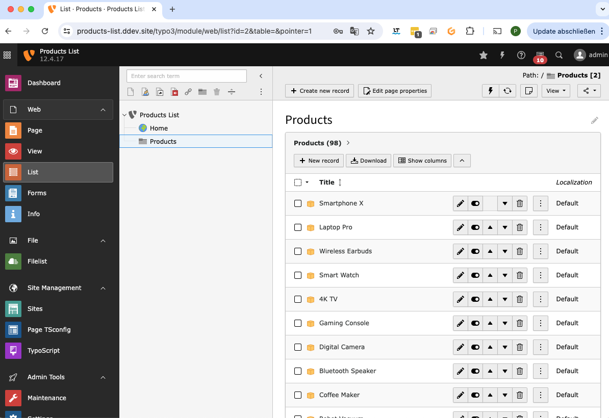

## Ein vorkonfiguriertes TYPO3-Projekt steht zur Verfügung. 
Es enthält eine DDEV-Umgebung mit einer vollständigen TYPO3-Installation und Beispieldaten für Produkte.

## Projekt-URLs

- **Frontend**: [https://products-list.ddev.site](https://products-list.ddev.site)
- **Backend**: [https://products-list.ddev.site/typo3](https://products-list.ddev.site/typo3)

  **Benutzername**: admin  
  **Passwort**: P@ssw0rd1

## Projektstart

Um das Projekt zu starten, folgen Sie bitte den nachstehenden Schritten:

1. **DDEV starten**
    ```sh
    ddev start
    ```

2. **In den Docker Web Container wechseln**
    ```sh
    ddev ssh
    ```

3. **TYPO3 installieren**
    ```sh
    ddev composer install
    ```

4. **Datenbank importieren**
    ```sh
    ddev typo3 database:import < db.sql
    ```

## Verzeichnisstruktur

Nach dem Import der Datenbank und dem Start der Anwendung sehen Sie die Struktur der Datensätze im Backend wie folgt:



## Weitere Hinweise

- **DDEV**: DDEV ist eine lokale Entwicklungsumgebung, die auf Docker basiert. Es ist bereits vorkonfiguriert, um das TYPO3-Projekt einfach zu starten und zu verwalten.
- **TYPO3**: TYPO3 ist ein leistungsfähiges Open-Source-Content-Management-System. In diesem Projekt wird TYPO3 verwendet, um eine dynamische und flexible Produktlistenansicht zu erstellen.


